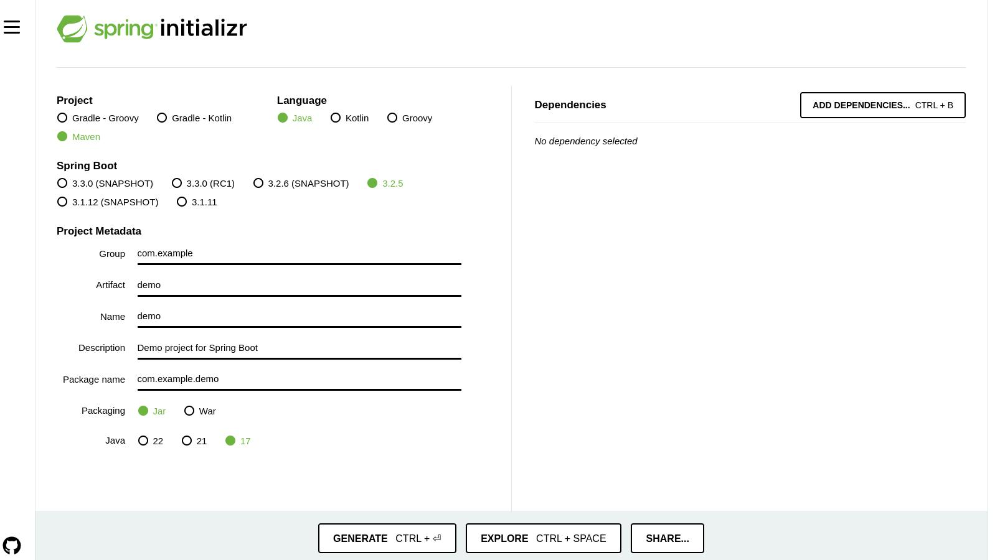
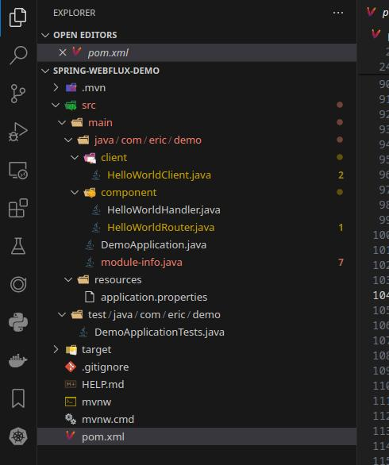
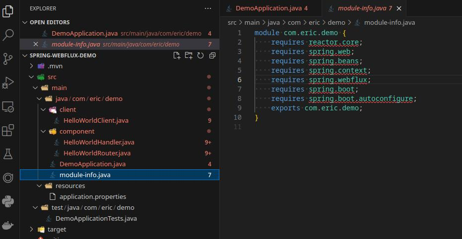
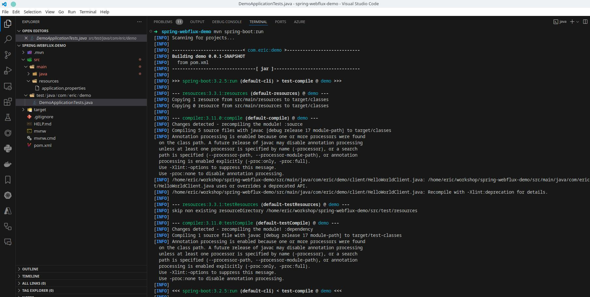
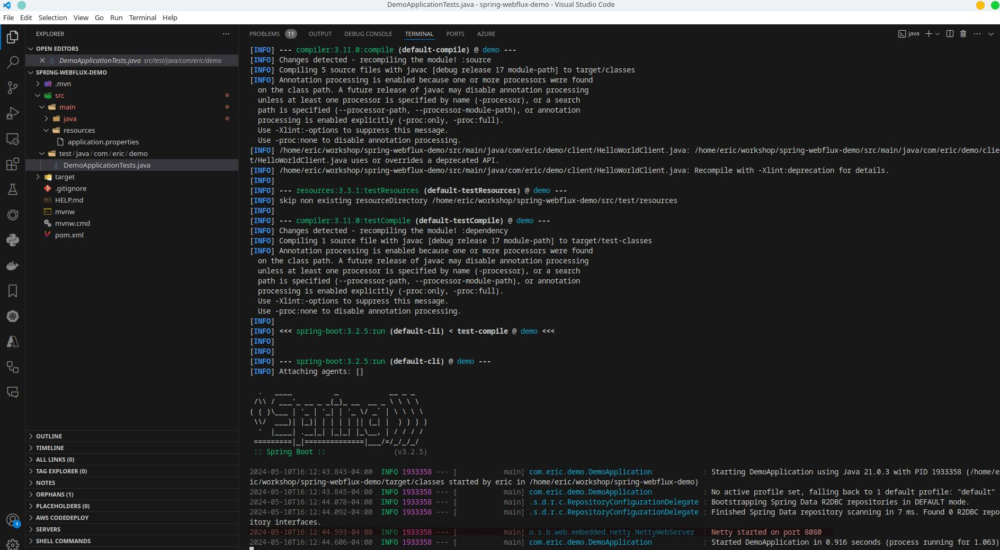
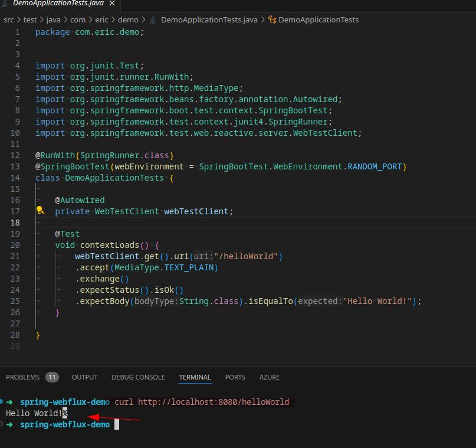
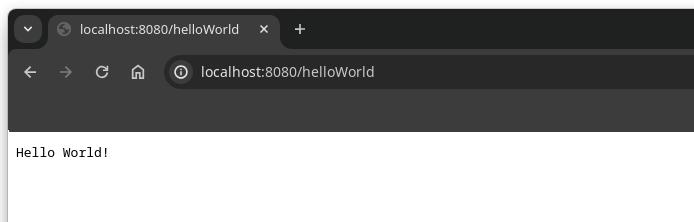
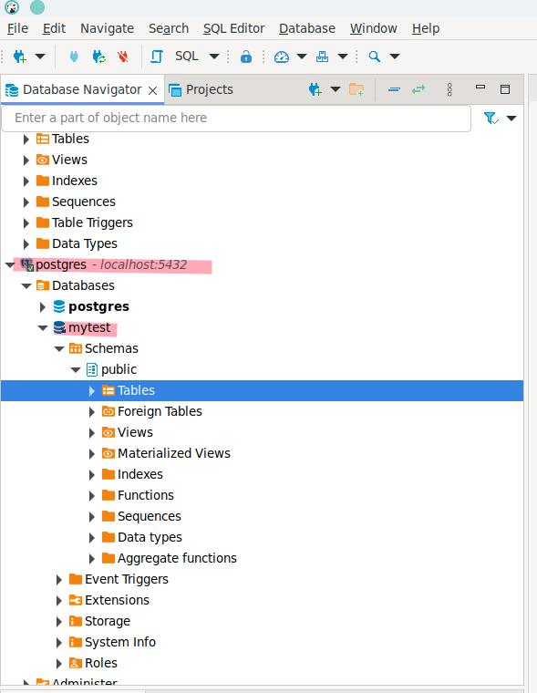

 
# Simple demo for Spring WebFlux framework
## How to create this project?

go to `start.spring.io` website, you can type some information about the package name and project name. then click `GENERATE` button to create project.

## My final Hello World project structure looks like the picture below.


## Change pom.xml file.
if you want to see the pom.xml, please go to the end of this document.
Because there are more informations, too long, so put the ends.

## Write your first Request Handle File.
We often return `Mono` and `Flux` as response in Spring Webflux framework.
The main difference between Mono and Flux in Spring WebFlux is the number of elements they can emit:
`Mono` is a reactive stream that can emit either zero or one element. It is optimized for handling single values. 
Examples:
```java
Mono<String> mn = Mono.just("hello");
```

`Flux` is a reactive stream that can emit zero to many elements. It is similar to Java 8 Streams but with the added capability of handling data arriving over time
Examples:
```java
Flux<String> fl = Flux.just("a", "b", "c");
```

Both `Mono` and `Flux` are implementations of the Publisher interface from Reactive Streams. They provide a rich set of operators to compose asynchronous logic. 

In general, you should use `Mono` when you expect zero or one result, such as the response from an HTTP request. `Flux` is more appropriate when you need to handle a stream of multiple elements, possibly even infinite. The choice between `Mono` and `Flux` depends on the nature of your application's workload

- For I/O-intensive operations, WebFlux can efficiently handle a large number of concurrent requests without blocking threads

- However, for CPU-intensive tasks, it might be more beneficial to explore alternative approaches
```java
package com.eric.demo.component;

import org.springframework.http.MediaType;
import org.springframework.stereotype.Component;
import org.springframework.web.reactive.function.BodyInserters;
import org.springframework.web.reactive.function.server.ServerRequest;
import org.springframework.web.reactive.function.server.ServerResponse;

import reactor.core.publisher.Mono;

@Component
public class HelloWorldHandler {
    public Mono<ServerResponse> helloWorld(ServerRequest request){
        return ServerResponse.ok().contentType(MediaType.TEXT_PLAIN).body(BodyInserters.fromValue("Hello World!"));
    }
}
```

## Write your first RouterFunction. 
In Spring WebFlux, a RouterFunction is used to route incoming requests to handler functions. It another way to do the annotation-based programming model such as Spring MVC.

A RouterFunction takes a ServerRequest and return a Mono<HandlerFunction>, which is equal to a @RquestMapping method in the annotation-based model. RouterFunctions.route() provides a builder to facilitates creating routers, for example:
```java
RouterFunction<ServerResponse> route = route()
    .GET("/person/{id}", accept(APPLICATION_JSON), handler::getPerson)
    .GET("/person", accept(APPLICATION_JSON), handler::listPeople)
    .POST("/person", handler::createPerson)
    .build();
```

In our simple project, we can write this code:
```java
import org.springframework.web.reactive.function.server.RouterFunctions;
import org.springframework.web.reactive.function.server.ServerResponse;
import org.springframework.web.reactive.function.server.RequestPredicates;
@Configuration
public class HelloWorldRouter {

    /**
     * @param helloWorldHandler
     * @return
     */
    @Bean
    public RouterFunction<ServerResponse> routeHelloWorld(HelloWorldHandler helloWorldHandler){
        return RouterFunctions.route(RequestPredicates.GET("/helloWorld")
        .and(RequestPredicates.accept(MediaType.TEXT_PLAIN)),helloWorldHandler::helloWorld);
    }
}
```

For I/O-intensive operations, using Spring WebFlux with RouterFunctions can be beneficial. WebFlux leverages non-blocking techniques to efficiently handle a large number of concurrent requests without blocking threads. This makes it well-suited for I/O-bound workloads that involve minimal CPU processing.

For CPU-intensive tasks, the non-blocking nature of WebFlux may not provide significant advantages. In such cases, it might be more prudent to explore alternative approaches.

## Using Spring Boot Application run it.
Then we should use this code to run our project:
```java
package com.eric.demo;

import org.springframework.boot.SpringApplication;
import org.springframework.boot.autoconfigure.SpringBootApplication;

@SpringBootApplication
public class DemoApplication {

	public static void main(String[] args) {
		SpringApplication.run(DemoApplication.class, args);
	}
}
```

We should added dependency of `spring-boot-starter-webflux` module in pom.xml file.

## Java 9 Modules Support
Java 9 introduced the Java Module System, also known as Project Jigsaw. This feature provides a higher level of organization for Java code, allowing developers to group related packages and classes into modules.

Key aspects of Java 9 Modules:

- Modules are defined in module-info.java files, where you specify the module name, exported packages, and dependencies
- Modules can export packages to make them accessible to other modules
- Modules can require other modules to access their exported packages
- Modules provide better encapsulation by default, as packages that are not exported are private to the module

Java 9 Modules is a significant feature that continues to be supported in Java 17 and later versions. It provides benefits in terms of organization, encapsulation, and dependency management, but also requires some adjustments in existing codebases and tooling.



## Using `mvn spring-boot:run` to run this project.


Successfully run:


## Using `curl http://localhost:8080/helloworld` command to test it.


## Using web browser to test it.


## Next project, we will implement a simple project to call PostgreSQL Database.
I have configured the `application.properties` file.

```yaml
spring.r2dbc.url=r2dbc:postgresql://localhost:5432/mytest
spring.r2dbc.username=postgres
spring.r2dbc.password=psql123456
```

I created a database `mytest` in PostgreSQL DB.



## more documents
### pom.xml file.
```xml
<?xml version="1.0" encoding="UTF-8"?>
<project xmlns="http://maven.apache.org/POM/4.0.0"
	xmlns:xsi="http://www.w3.org/2001/XMLSchema-instance"
	xsi:schemaLocation="http://maven.apache.org/POM/4.0.0 https://maven.apache.org/xsd/maven-4.0.0.xsd">
	<modelVersion>4.0.0</modelVersion>
	<parent>
		<groupId>org.springframework.boot</groupId>
		<artifactId>spring-boot-starter-parent</artifactId>
		<version>3.2.5</version>
		<relativePath /> <!-- lookup parent from repository -->
	</parent>
	<groupId>com.eric</groupId>
	<artifactId>demo</artifactId>
	<version>0.0.1-SNAPSHOT</version>
	<name>demo</name>
	<description>Demo project for Spring Webflux</description>

	<properties>
		<project.build.sourceEncoding>UTF-8</project.build.sourceEncoding>
		<project.reporting.outputEncoding>UTF-8</project.reporting.outputEncoding>
		<jdk.version>17</jdk.version>
	</properties>

	<dependencies>
		**<dependency>
			<groupId>org.springframework.boot</groupId>
			<artifactId>spring-boot-starter</artifactId>
		</dependency>

		<dependency>
			<groupId>org.springframework.boot</groupId>
			<artifactId>spring-boot-starter-webflux</artifactId>
		</dependency>

		<dependency>
			<groupId>org.springframework.boot</groupId>
			<artifactId>spring-boot-starter-test</artifactId>
			<scope>test</scope>
		</dependency>**

		<dependency>
			<groupId>org.springframework.boot</groupId>
			<artifactId>spring-boot-starter-data-r2dbc</artifactId>
		</dependency>

		<dependency>
			<groupId>junit</groupId>
			<artifactId>junit</artifactId>
			<version>4.13.1</version>
			<scope>test</scope>
		</dependency>

		<dependency>
			<groupId>com.h2database</groupId>
			<artifactId>h2</artifactId>
			<scope>runtime</scope>
		</dependency>

		<dependency>
			<groupId>io.r2dbc</groupId>
			<artifactId>r2dbc-h2</artifactId>
			<scope>runtime</scope>
		</dependency>

		<dependency>
			<groupId>io.r2dbc</groupId>
			<artifactId>r2dbc-postgresql</artifactId>
			<version>0.8.3.RELEASE</version>
			<scope>runtime</scope>
		</dependency>

		<dependency>
			<groupId>org.postgresql</groupId>
			<artifactId>postgresql</artifactId>
			<scope>runtime</scope>
		</dependency>

		<dependency>
			<groupId>org.projectlombok</groupId>
			<artifactId>lombok</artifactId>
			<optional>true</optional>
		</dependency>

		<dependency>
			<groupId>io.projectreactor</groupId>
			<artifactId>reactor-test</artifactId>
			<scope>test</scope>
		</dependency>

		<!-- import swagger for document and test -->
		<dependency>
			<groupId>io.springfox</groupId>
			<artifactId>springfox-swagger2</artifactId>
			<version>3.0.0</version>
		</dependency>
		<dependency>
			<groupId>io.springfox</groupId>
			<artifactId>springfox-swagger-ui</artifactId>
			<version>3.0.0</version>
		</dependency>
		<dependency>
			<groupId>io.springfox</groupId>
			<artifactId>springfox-boot-starter</artifactId>
			<version>3.0.0</version>
		</dependency>
		<dependency>
			<groupId>io.springfox</groupId>
			<artifactId>springfox-spring-webflux</artifactId>
			<version>3.0.0</version>
		</dependency>
	</dependencies>

	<build>
		<plugins>
			<plugin>
				<groupId>org.springframework.boot</groupId>
				<artifactId>spring-boot-maven-plugin</artifactId>
			</plugin>
		</plugins>
	</build>

	<repositories>
		<repository>
			<id>central</id>
			<name>Central Repository</name>
			<url>https://repo.maven.apache.org/maven2</url>
			<layout>default</layout>
			<snapshots>
				<enabled>false</enabled>
			</snapshots>
		</repository>
		<repository>
			<id>spring-snapshots</id>
			<name>Spring Snapshots</name>
			<url>https://repo.spring.io/snapshot</url>
			<snapshots>
				<enabled>true</enabled>
			</snapshots>
		</repository>
		<repository>
			<id>spring-milestones</id>
			<name>Spring Milestones</name>
			<url>https://repo.spring.io/milestone</url>
			<snapshots>
				<enabled>false</enabled>
			</snapshots>
		</repository>
	</repositories>

	<pluginRepositories>
		<pluginRepository>
			<id>spring-snapshots</id>
			<name>Spring Snapshots</name>
			<url>https://repo.spring.io/snapshot</url>
			<snapshots>
				<enabled>true</enabled>
			</snapshots>
		</pluginRepository>
		<pluginRepository>
			<id>spring-milestones</id>
			<name>Spring Milestones</name>
			<url>https://repo.spring.io/milestone</url>
			<snapshots>
				<enabled>false</enabled>
			</snapshots>
		</pluginRepository>
	</pluginRepositories>
</project>
``` 